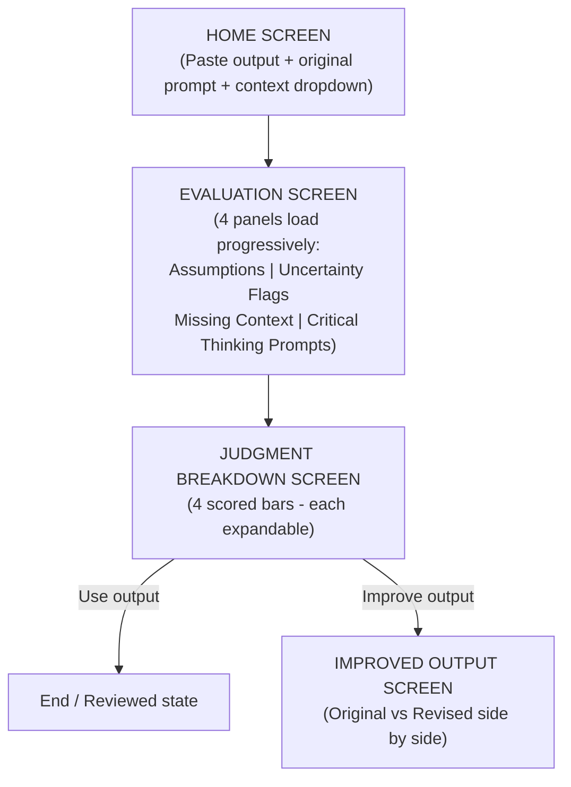

# Implementation Plan — Judgment Layer

Judgment Layer is an AI-powered output evaluation tool for students, built to analyze ChatGPT outputs. It allows students to paste AI-generated outputs, analyze them across multiple dimensions (assumptions, uncertainty, missing context, critical thinking prompts), view a judgment score breakdown, and generate an improved version of the output.

The backend uses a **hybrid LLM routing strategy**:
- **Groq API (`llama-3.1-8b-instant`)** — handles the 5 concurrent evaluation calls (called multiple times per run, near-instantaneous).
- **Gemini API (`gemini-2.5-flash`)** — handles the single output improvement call (called once per run, strong contextual rewrite capability).

---

## App Flow (UI Diagram)



---

## Project Phases & Directory Structure

To support structured, incremental progression, the codebase is divided into four distinct phases. The files for each phase will be isolated in their own folders: `phase1`, `phase2`, `phase3`, and `phase4`.

To fit the local system environment (which has Python 3 but not Node/npm), we use a zero-dependency **Python 3** HTTP server to proxy requests securely to Groq and Gemini APIs.

```
Judgment Layer/
├── phase1/                 # Phase 1: Skeleton & Setup
│   ├── .env
│   ├── server.py           # Python 3 server (zero external dependencies)
│   └── public/
│       ├── index.html
│       ├── style.css
│       └── app.js
├── phase2/                 # Phase 2: Core Progressive Panels
│   ├── .env
│   ├── server.py
│   └── public/
│       ├── index.html
│       ├── style.css
│       └── app.js
├── phase3/                 # Phase 3: Judgment Score Breakdown
│   ├── .env
│   ├── server.py
│   └── public/
│       ├── index.html
│       ├── style.css
│       └── app.js
└── phase4/                 # Phase 4: Full App with Improved Output
    ├── .env
    ├── server.py
    └── public/
        ├── index.html
        ├── style.css
        └── app.js
```

---

## Phase Details

### Phase 1: Skeleton Setup & Home Screen UI
- **Goal**: Implement the basic server setup and the Home/Input Screen UI. Include structural skeletons for subsequent pages.
- **Files**:
  - `phase1/server.py`: Serves static files from `public/` and handles `/api/health`.
  - `phase1/public/index.html`: Home page markup (pastes, prompt, context, CTA).
  - `phase1/public/style.css`: The styling system foundation (Teal accent, Google Fonts, reset).
  - `phase1/public/app.js`: State management to handle page switching and mockup event handlers.

### Phase 2: Core Progressive Panels (Groq Integration)
- **Goal**: Hook up the 4 evaluation panels to Groq API. Show progressive loading states (skeleton screens) as the results resolve one by one.
- **Files**:
  - `phase2/server.py`: Implements backend routing for `/api/analyze/assumptions`, `/api/analyze/uncertainty`, `/api/analyze/context`, and `/api/analyze/prompts` using Groq API (`llama-3.1-8b-instant`).
  - `phase2/public/app.js`: Concurrent fetch requests to all 4 endpoints. Renders the content as it returns.
  - `phase2/public/index.html` & `style.css`: Layout and styling for the 4-panel dashboard with loader states and hover tooltips for assumptions.

### Phase 3: Judgment Score Breakdown
- **Goal**: Add the Judgment Score breakdown with 4 interactive, expandable rating bars (Reasoning, Completeness, Factual Confidence, Usefulness) and summary description.
- **Files**:
  - `phase3/server.py`: Adds the `/api/analyze/score` endpoint to prompt Groq for the breakdown ratings and plain text explanations.
  - `phase3/public/app.js`: Calls the scoring endpoint. Handles click events on the rating bars to expand/collapse details. Shows the bottom summary text and two CTA buttons.

### Phase 4: Improved Output Screen (Full App)
- **Goal**: Complete the flow by adding the Side-by-Side Comparison Screen. If the student clicks "Help me improve this output", Gemini generates the revised text.
- **Files**:
  - `phase4/server.py`: Adds the `/api/improve` endpoint to generate improved content using Gemini API based on original text + findings.
  - `phase4/public/app.js`: Triggers the improvement call. Highlights changes in green using inline visual differences. Implements the clipboard copy button.
  - `phase4/public/index.html` & `style.css`: Refines CSS layouts for side-by-side viewports and visual comparison highlights.

---

## System Prompts & User Prompt Formatting

To ensure the UI is rich (tooltips, expandable elements, comparison highlighting), we ask Groq and Gemini to return structured JSON responses.

#### 1. Assumptions Made (Phase 2)
- **System Prompt**:
  > You are an AI output analyst. Given the following AI-generated response, identify 3–5 hidden assumptions the AI made while generating it. Be specific and concise. Return as bullet points only.
- **User Prompt Supplement**:
  > Please format your response strictly as a JSON array of objects.
  > Format:
  > `[{"assumption": "Description of the assumption", "why_it_matters": "Why this assumption matters to the user"}]`

#### 2. Uncertainty Flags (Phase 2)
- **System Prompt**:
  > You are an AI output analyst. Given the following AI-generated response, identify 2–3 specific sentences or claims that have low confidence or cannot be easily verified. For each, explain in one plain sentence why it is uncertain. Return as a list.
- **User Prompt Supplement**:
  > Please format your response strictly as a JSON array of objects.
  > Format:
  > `[{"sentence": "The flagged sentence from the original text", "reason": "Plain English explanation of why it is uncertain"}]`

#### 3. Missing Context (Phase 2)
- **System Prompt**:
  > You are an AI output analyst. Given the following AI-generated response and the original question, identify 2–4 important pieces of context, perspective, or information that are missing from this response. For each gap suggest how the student could fill it.
- **User Prompt Supplement**:
  > Please format your response strictly as a JSON array of objects.
  > Format:
  > `[{"gap": "Description of the missing context", "how_to_fill": "Actionable suggestion to fill this gap"}]`

#### 4. Critical Thinking Prompts (Phase 2)
- **System Prompt**:
  > You are an AI output analyst. Given the following AI-generated response, generate 4–5 critical thinking questions a student should ask themselves before trusting and using this output. Make each question specific to the content, not generic.
- **User Prompt Supplement**:
  > Please format your response strictly as a JSON array of objects.
  > Format:
  > `[{"question": "The question itself (e.g. 'Does this match...?')", "explanation": "A short explanation of why this question matters to help evaluate the output"}]`

#### 5. Judgment Score (Phase 3)
- **System Prompt**:
  > You are an AI output analyst. Given the following AI-generated response, original prompt, and its analysis, rate the output across four categories: Reasoning Quality, Completeness, Factual Confidence, and Usefulness. Rate each as 'Low', 'Medium', or 'High' and explain why. Finally, write a summary sentence.
- **User Prompt Supplement**:
  > Format:
  > `{
  >   "reasoning": {"score": "Low"|"Medium"|"High", "explanation": "Explanation..."},
  >   "completeness": {"score": "Low"|"Medium"|"High", "explanation": "Explanation..."},
  >   "factual_confidence": {"score": "Low"|"Medium"|"High", "explanation": "Explanation..."},
  >   "usefulness": {"score": "Low"|"Medium"|"High", "explanation": "Explanation..."},
  >   "summary": "This output is a good starting point but needs verification on X key points..."
  > }`

#### 6. Improve Output (Phase 4)
- **System Prompt**:
  > You are an AI output improver. Given the original AI response, original prompt, and its analysis (assumptions, flags, missing context), output an improved version of the text that fills in gaps and resolves uncertainty. Also list the major changes you made and the reasons for them.
- **User Prompt Supplement**:
  > Format:
  > `{
  >   "improved_output": "The improved response text...",
  >   "changes": [{"change": "Description of change", "reason": "Explanation of why"}]
  > }`

---

## Verification Plan

### Automated/Local Tests
1. Verify server starts on local port (e.g., 8000) using python commands.
2. Call backend endpoints manually using PowerShell `Invoke-RestMethod` to verify structured JSON responses.
3. Test front-end responsiveness and visual aesthetics in different screen sizes.

### Manual Verification Steps
1. Open application in browser.
2. Input a sample AI prompt & output (e.g., a history essay draft with an unverified date).
3. Confirm that all 4 panels load progressively with skeleton loader states.
4. Verify hover tooltips on Assumptions and expandable details on Critical Thinking questions.
5. Expand the bars on the Judgment Score screen.
6. Click "Help me improve this output" to review the side-by-side comparison with green diff highlights.
7. Click "Copy Improved Output" and verify it copies successfully to the clipboard.
